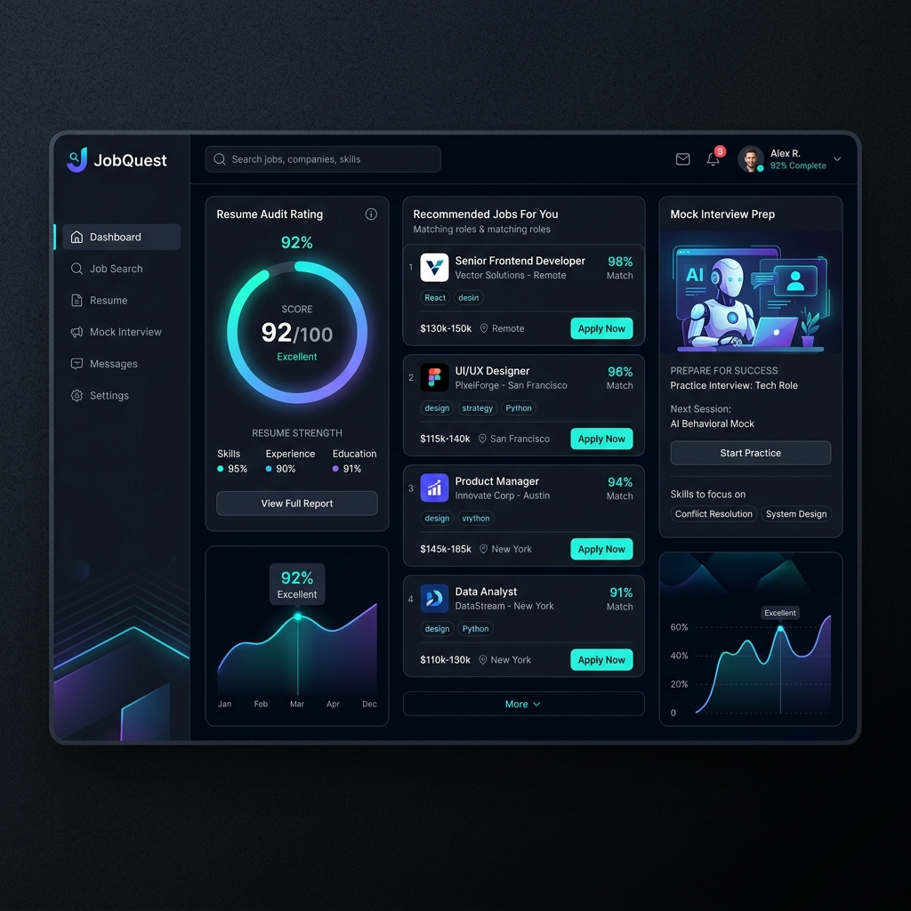

# 💼 JobQuest - AI-Powered Full-Stack Job Portal

[](https://react.dev/)
[](https://nodejs.org/)
[](https://www.mongodb.com/)
[](https://tailwindcss.com/)
[](https://deepmind.google/technologies/gemini/)

JobQuest is a premium, full-stack job board for candidates and recruiters. It enhances traditional job matching by integrating Google's Gemini LLMs for AI-driven Resume auditing, vector job matching, and technical mock interviews.

---

## 🔗 Live Links
- **Live Application (Vercel)**: [fullstack-jobquest.vercel.app](https://fullstack-jobquest.vercel.app)

---

## 🖥️ Application Preview



---

## 🌟 Key Features

### 👨‍💻 Candidate Suite
1. **AI Resume-to-Job Matcher (`/ai-matching`)**:
   - Generates high-fidelity vector embeddings (768-dimension) of the candidate's profile/resume.
   - Computes **Vector Cosine Similarity** against active job post embeddings.
   - Leverages **RAG (Retrieval-Augmented Generation)** to construct a detailed feedback report outlining fit alignment.
2. **Automated Resume Auditor (`/resume-review`)**:
   - Analyzes uploaded resumes and provides a dynamic rating score (0-100).
   - Identifies skills gaps compared to current industry benchmarks and outputs action steps.
3. **Interactive Mock Interview Simulator (`/interview-prep`)**:
   - Supported Tracks: *Frontend, Backend, Fullstack, or AI Engineering*.
   - A realistic CLI terminal poses industry-relevant technical questions one-by-one.
   - Submissions receive instant grading (1-10), qualitative reviews, and correct model answers.
4. **AI Career Chatbot**:
   - A floating career advisor widget powered by Gemini to answer resume-writing, career-path, and interview questions.

### 💼 Recruiter Suite
1. **Company Profiles**: Register organizations and manage logo, branding, description, and headquarters location.
2. **Job Post Manager**: Create, publish, filter, and delete job openings with specific salary ranges, positions, experience levels, and requirements.
3. **Applicant Auditing**: Review applicant profiles/resumes, download CVs, and transition application states (*Pending, Accepted, Rejected*).

---

## ⚙️ Robust Dual-Mode Engine

To guarantee 100% platform uptime and prevent failures under API quota limits:
- **AI Mode (Gemini)**: Utilizes the Google AI SDK (`gemini-2.0-flash` & `text-embedding-004`) to compute vector embeddings and perform code evaluations.
- **Smart Local Fallback**: If Gemini is rate-limited (`429 Quota Exceeded`) or credentials are absent, the system seamlessly triggers local keyword-based parsers, Jaccard-similarity matching, and statistical text metrics to keep scoring, search, and interview engines operational without interface crashes.

---

## 🛠️ Technology Stack

| Layer | Technologies |
| :--- | :--- |
| **Frontend** | React.js (Vite), Tailwind CSS, Redux Toolkit, Redux Persist, Framer Motion, Axios |
| **Backend** | Node.js, Express.js, MongoDB + Mongoose ORM, JSON Web Tokens (JWT), cookie-parser |
| **AI / NLP** | Google Gemini API SDK, Vector Cosine Similarity Search |
| **Storage / Assets** | Cloudinary API, Multer (multipart parser) |

---

## 📁 Project Structure

```text
fullstack-jobquest/
├── frontend/             # React (Vite) Frontend client
│   └── src/              # Pages (AIMatching, ResumeReview, MockInterview), Redux slices, Axios hooks
└── backend/              # Express API Server
    ├── controllers/      # Route request handlers
    ├── models/           # MongoDB Mongoose schemas
    ├── routes/           # REST endpoints
    └── utils/            # Gemini client, DB connectivity, and asset upload helper configs
```

---

## 🚀 Local Installation & Setup

### Prerequisites
- [Node.js](https://nodejs.org/) installed
- [MongoDB](https://www.mongodb.com/) local instance or Atlas Cloud database

### Step 1: Clone the Repository
```bash
git clone https://github.com/DIPANSHU66/fullstack-jobquest.git
cd fullstack-jobquest
```

### Step 2: Configure & Start Backend
1. Navigate to the `backend` folder and install dependencies:
   ```bash
   cd backend
   npm install
   ```
2. Create a `.env` file in the `backend/` directory:
   ```env
   PORT=8000
   MONGODB_URI=your_mongodb_atlas_connection_string
   SECRET_KEY=your_jwt_signing_key
   CLOUD_NAME=your_cloudinary_cloud_name
   API_KEY=your_cloudinary_api_key
   API_SECRET=your_cloudinary_api_secret
   URL=http://localhost:5173
   FRONTEND_URL=http://localhost:5173
   GEMINI_API_KEY=your_gemini_api_key
   ```
3. Start the backend development server:
   ```bash
   npm run dev
   ```

### Step 3: Configure & Start Frontend
1. Navigate to the `frontend` folder and install dependencies:
   ```bash
   cd ../frontend
   npm install
   ```
2. Create a `.env` file in the `frontend/` directory:
   ```env
   VITE_API_URL=http://localhost:8000/api/v1
   ```
3. Start the frontend Vite development server:
   ```bash
   npm run dev
   ```

---

## 🛡️ License & Contributions
This project is open-source. Contributions, issues, and feature requests are welcome!

---

*Made with ❤️ by [Dipanshu Bansal](https://github.com/DIPANSHU66)*
